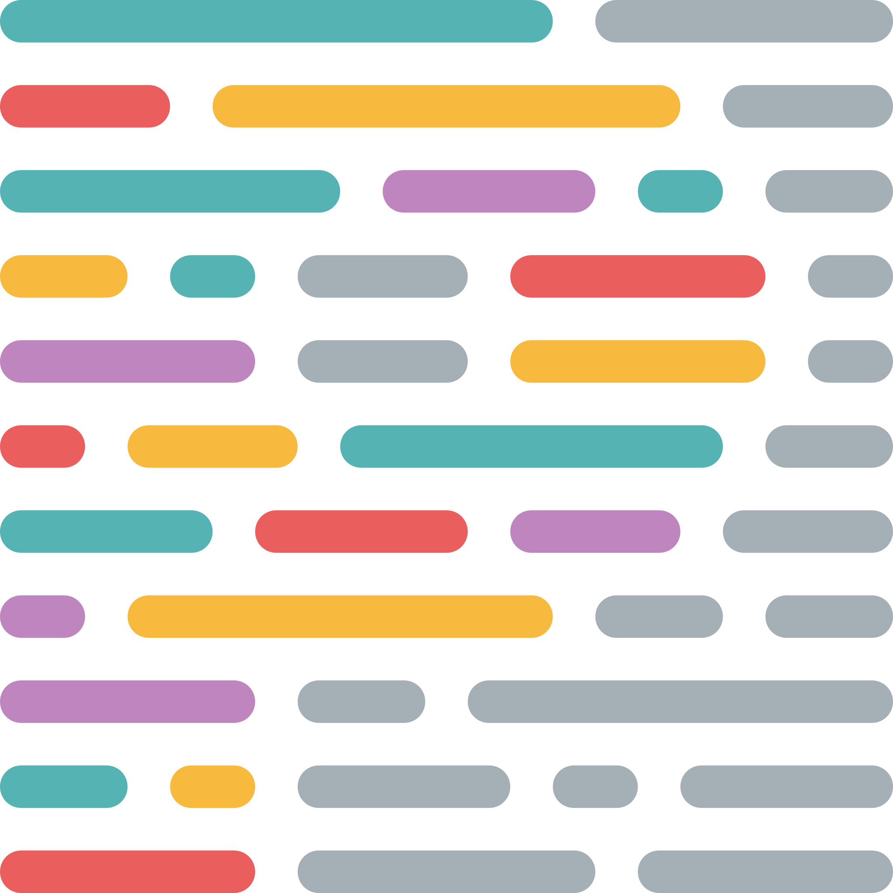
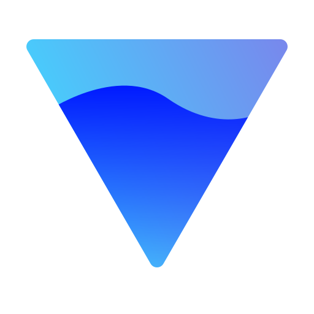
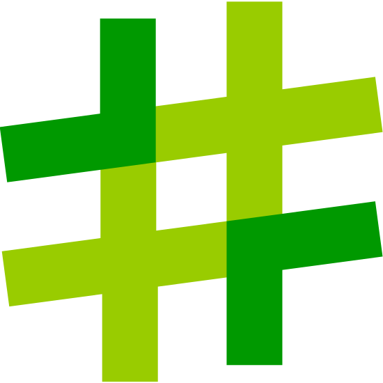

<h1>Hey, nice to meet you </h1>
<h2> About Me:</h2>

I am a <b>Front-end (Vue.js)</b> / FullStack Engineer. 
    Worked as out-staff employee, also personally mentoring people.
    Always in searching for collaborations.

<ul>
    <li>🔭 I’m currently working on: <b>Improving myself</b></li>
    <li>🌱 I’m currently learning: <b>Nuxt.Js, deeper backend theory</b></li>
    <li>👯 I’m looking to collaborate on: <b>Perspective startup or product company</b></li>
    <li>💬 Ask me about: <b>What I do best</b></li>
    <li>📫 How to reach me: <b>Contacts linked below</b></li>
    <li>😄 Pronouns: <b>He / His</b></li>
    <li>⚡ Fun fact: <b>I love video-calls and talk with people</b></li>
    <li>🤝 Ready to be hired: <b>true</b></li>
</ul>
<h3>Tech stack & tools:</h3>

    
    
    
    
    
    
    
    
    
    
    
    
    
    
    
    
    
    
    
    
    
    
    
    
    
    
    
    
    
    
    
    
    
    
    
    
    
    
    
    
    
    
    
    

<h3>Funny badges:</h3>

    

        
    

    

        
    

    

        
    

    

        
    
 

<h2>Contacts:</h2>

If you notice any bug, or you want to suggest an idea, please contact me.

<ul>
    <li><b><a href="https://t.me/Blatisgense">Telegram </a></b>@Blatisgense (best way)</li>
    <li><b><a href="https://discordapp.com/users/559703556295360512">Discord </a></b>blatisgense</li>
    <li><b><a href="mailto:lavr.marudenko@gmail.com">Email </a></b>lavr.marudenko@gmail.com</li>
</ul>
